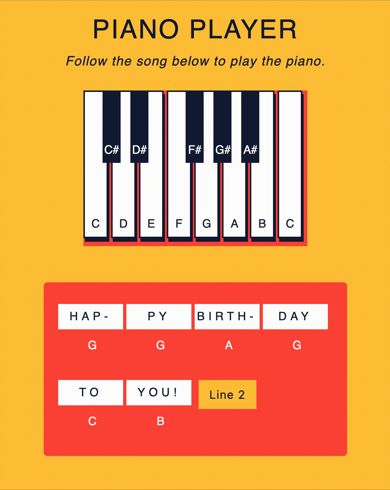

# Piano Keys

_From CodeCademy – Building Interactive Javascript Website_

You’re a web developer who has been hired by a music education company. This client wants you to create an interactive game to help their beginner-level piano students study. Create a piano player with DOM events in JavaScript!

Result:

